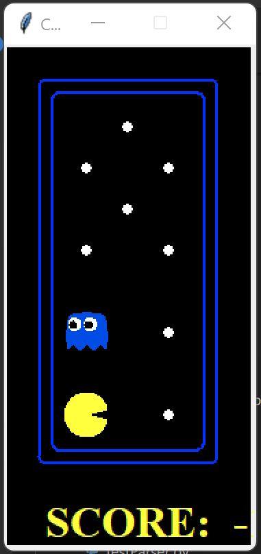
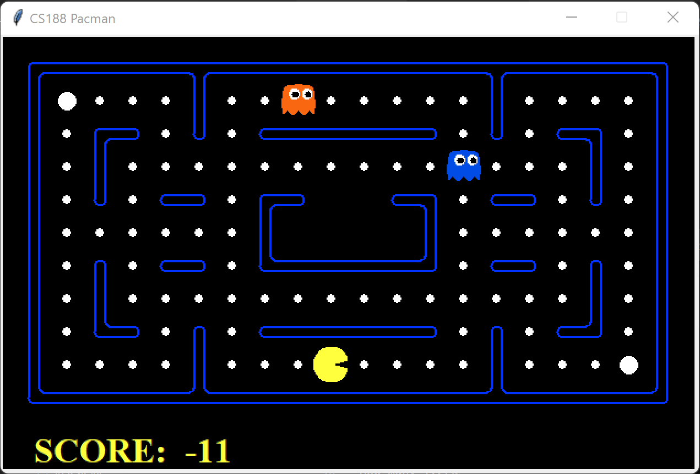

# AI Pacman with Reinforcement Learning
This work was done for Santa Clara University's Artificial Intelligence course taught by Professor Liu

## Introduction

I built an AI-based Pacman using a reinforcement learning technique called approximate Q-learning. Using features that represented the Q-states, Pacman was successful in learning to play after ~200 training games. On the *mediumClassic* map with 2 ghosts, the Pacman agent had a win rate of 90%.

<p align="center">
  Example of AI Pacman agent playing 
</p>


## Dataset

Pacman Game

The Pacman framework was developed by John DeNero and Dan Klein who are Computer Science professors at UC Berkeley. The original project can be found [here](http://ai.berkeley.edu/project_overview.html). The project was built to help teach students foundational AI concepts such as informed state-space search, probabilistic inference, and reinforcement learning. The game comes with many different layouts, but this project only used the *testClassic* and *mediumClassic* layouts as seen in the images below. The framework handles the graphics and game logistics, allowing students to focus on building the intelligent agent that navigates the map. 

<p align="center">

| testClassic map                                            | mediumClassic map                                               |
| :--------------------------------------------------------: | :-------------------------------------------------------------: |
|  |   

</p> 

## Quick Reinforcement Learning Review

Reinforcement learning is a machine learning paradigm where an intelligent agent takes actions in an environment in order to maximize its cumulative reward. This can be mathematically formulated through Markov Decision Processes (MDPs) where there are states, actions, and rewards.

State: The current situation that the agent is in. 

Action: The decision that the agent makes to reach a certain state or reward

Reward: Given after performing an action and normally a function of the starting state, action just taken, and the end state. The goal of the agent is to maximize long term rewards.

An MDP then can be formally defined as 
* A set of states s
* A set of actions a
* A transition function T(s, a, s') or model
  * Probability that a from s leads to s'
* A reward function
  * R(s,a,s')

MDPs are non-deterministic search problems such that an agent wants an optimal plan, or sequence of actions, to maximize their reward. This is called a policy which gives an action to take given each state. Defined as pi*(s)

The value or utility of a state is the expected utility from starting in s and acting optimally. In other words, it's a function of the future rewards from being in a state and/or action when following a particular policy. Defined as V*(s) 

The value or utility of a q-state is the expected utility starting out having taken action a from state s and thereafter acting optimally. Defined as Q*(s,a) 

The optimal policy can be computed through an iterative search through all states and actions using the Bellman Update. Reinforcement learning is then formally defined as trying to find the optimal policy but the model or the reward functions are unknown. This requires the agent to explore their environment and learn which states exist, the actions to get to them, and the reward received. This is called Q-learning. Each q-state is approximated through trial and error which eventually converges to the optimal policy. 

<p align="center">
  
</p>

However, the issue with the MDP structure is that there are often far too many states to build a lookup table with an optimal action given any state. Therefore, we instead need some way to take a description of our state and produce Q-values for actions. This is done through neural networks which act as a function approximator. Features about the state are generated that capture important properties of the state and represented as a vector. The neural network then learns to take this vector and map it to an appropriate Q-value. In this project we use linear approximations mathematically expressed below. This becomes an approximation of the Q-value

<p align="center">
  
</p>

In order to update the weights, we take the target Q-value (or sample) and subtract the current predicted Q-value. The weights are then adjusted with alpha indicating the learning rate.

<p align="center">
  
</p>

<p align="center">
  
</p>

<p align="center">
  
</p>

## My Model

To successfully build an agent that could navigate the *mediumClassic* map, approximate Q-learning was used as explained above so that Pacman didn't have to learn the actual states but instead learned the features that define the states. Below are the features used

* Active ghost one step away (binary)
* Active ghost two steps away (binary)
* Scared ghost one step away (binary)
* Scared ghost two steps away (binary)
* Whether Pacman was eating food (binary)
* 1/minimum distance to closest food

To determine the location of ghosts, an iterative deepening search was employed. Manhattan distance was originally used to find the closest ghost but the issue with this is that it goes through walls. Therefore, Pacman would think a ghost is close when it was on the other side of a wall. It was found that using an IDS with a limit of three was capable of accurately determining if a ghost was within one or two steps away.
To find the closest food available, IDS was initially used as it provides a more accurate solution but once the limit got above 4 and there wasn't much food left it executed rather slowly. The cheaper solution of Manhattan distance was used instead but this is a non-optimal solution. Improved performance can be achieved with a better designed algorithm for finding food since occasionally Pacman will be determine that food is on the other side of the wall and get stuck. The following rewards were used

<p align="center">

| Rewards                      | Points   |
| :--------------------------: | :------: |
| Running into an active ghost | -250     |
| Eating a scared ghost        | +100     |
| Winning (eating last dot)    | +250     |
| Eating a single dot          | +1       |
| Not eating anything          | -1       |

<P>

## Training

Pacman was trained with the *mediumClassic* map with two ghosts. It took approximately 200 games for the feature weights to converge. Given the small model size it was trained on a laptop with an Intel i7 and 32GB of RAM. The weights converted to 

* Feature weight 1: -5.21
* Feature weight 2: -4.53
* Feature weight 3: 1.86
* Feature weight 4: 0.793
* Feature weight 5: 1.03
* Feature weight 6: 1.61

## Results

| Map                          | Win Rate of 40 games played |
| :--------------------------: | :-------------------------: |
| testClassic                  | 100%                        |
| mediumClassic with 1 ghost   | 97%                         |
| mediumClassic with 2 ghosts  | 90%                         |

## Usage

File Description (main files only)
* multiAgents.py - Where search agent resides
* pacman.py - Main file that runs Pacman. Also describes the GameState 
* game.py - Logic behind how Pacman world works. Also describes several supporting file types such as AgentState, Agent, Direction, and Grid
* graphicsDisplay.py - Graphics for Pacman
* graphicsUtil.py - Support for Pacman graphics
* textDisplay.py - ASCII graphics for Pacman
* ghostAgents.py - Agents to control ghosts
* keyboardAgetns.py - Keyboard interfaces to control Pacman
* layout.py - Code for reading layout files and storing their contents

***

Play a classic game of Pacman using the arrow keys to move

```sh
    python pacman.py -l testClassic
```

OR 

```sh
    python pacman.py -l mediumClassic
```

How to Train

Copy *multiAgents.py* and *weights.csv* from the *training* directory into the main src directory (where pacman.py lives) and run the following command below

```sh
    python autoTrain.py
```

How to Test

Copy *multiAgents.py* and *weights.csv* from the *testing* directory into the main src directory (where pacman.py lives) and run the following command below. This will auto run the Pacman with the current weights derived in *weights.csv*

```sh
    python autoPlay.py
```

To observe a single game of Pacman run the command below

```sh
python pacman.py -p ReflexAgent -l mediumClassic --frameTime 0
```